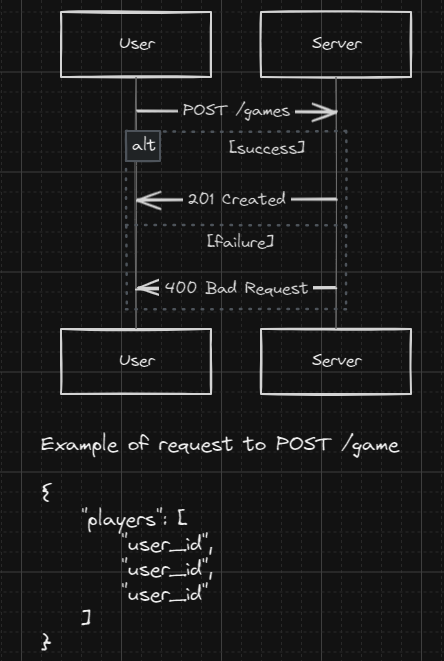
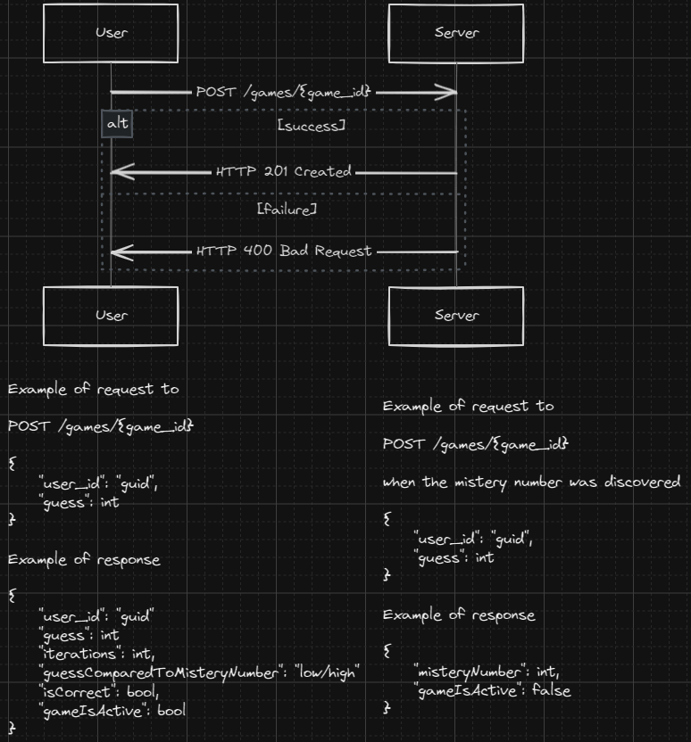

# Gaming1 Challenge

Implementation of HI LO game. The player needs to discover the mistery number, generated randomly by the game

## Requirements :wrench:

- .NET ([download](https://dotnet.microsoft.com/download/))
- Visual Studio Code ([download](https://code.visualstudio.com/#alt-downloads))

## Endpoints :rocket:

- POST api/v1/games

Endpoint to create a new game, sending the list of players in the body
and returning http status 201 with the game id and the list of players.

Request:

```json
Accept: application/json
Content-Type: application/json

{
    "playersId": [
        "033406b0-e3bd-40c5-a978-448f0b058bd8",
        "5436e1db-afe0-488f-ad5f-02380ea87dea"
    ]
}
```

Response:

```json
HTTP/1.1 201 Created
Connection: close
Content-Type: application/json; charset=utf-8
Server: Kestrel
Location: /games/c0381991-613b-44b5-88f0-472ccaa18981
Transfer-Encoding: chunked

{
    "id": "c0381991-613b-44b5-88f0-472ccaa18981",
    "playersId": [
        "033406b0-e3bd-40c5-a978-448f0b058bd8","5436e1db-afe0-488f-ad5f-02380ea87dea"
    ],
    "timestamp": "2024-02-21T14:26:22.4580073Z"
}
```


- POST api/v1/games/{id}

Endpoint to play the game sending the game id in url as well the player id and player guess number in the body. The response is 201 for success with the property ```playerGuessComparedWithMisteryNumber``` informing if it's high, low or equal when the player guess the correct number.

Request:

```json
Accept: application/json
Content-Type: application/json

{
    "playerId": "033406b0-e3bd-40c5-a978-448f0b058bd8",
    "playerGuessNumber": 70
}
```

Response:

```json
HTTP/1.1 201 Created
Connection: close
Content-Type: application/json; charset=utf-8
Server: Kestrel
Transfer-Encoding: chunked

{
  "playerId": "033406b0-e3bd-40c5-a978-448f0b058bd8",
  "playerGuessNumber": 70,
  "playerIterations": 1,
  "playerGuessComparedWithMisteryNumber": "higher",
  "isPlayerGuessCorrect": false,
  "isGameActive": true
}
```

## Usage :building_construction:

1. Clone the repo: ```git clone https://github.com/wbail/gaming1challenge```
2. Open Visual Studio Code and then open the project inside it
3. Run the project pressing ```F5```, it will open the Swagger in a browser tab

## Architecture :triangular_ruler:





## Support :construction_worker:

In case of features or bugs, please contact me or open a PR

### Developer(s)
- Guilherme Bail ([email](mailto:guilhermedanbail@gmail.com), [github](https://github.com/wbail))